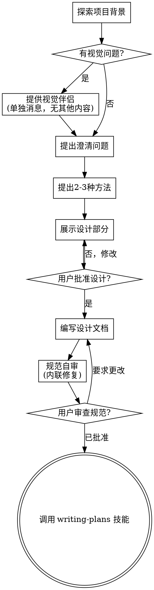

# 头脑风暴：将想法转化为设计

通过自然的协作对话帮助将想法转化为完整的设计和规范。

首先了解当前项目背景，然后逐个提问来完善想法。一旦理解了要构建的内容，展示设计并获得用户批准。

<HARD-GATE>
在展示设计并获得用户批准之前，不要调用任何实现技能、编写任何代码、搭建任何项目或采取任何实现行动。这适用于每个项目，无论看起来多么简单。
</HARD-GATE>

## 反模式："这太简单了，不需要设计"

每个项目都要经过这个过程。待办列表、单功能工具、配置更改——所有这些都包括。"简单"的项目正是未经审查的假设导致最多浪费工作的地方。设计可以很短（对于真正简单的项目只需几句话），但你必须展示它并获得批准。

## 检查清单

你必须为以下每项创建任务并按顺序完成：

1. **探索项目背景** — 检查文件、文档、最近提交
2. **提供视觉伴侣**（如果主题涉及视觉问题）— 这是单独的消息，不与澄清问题结合。请参阅下面的视觉伴侣部分。
3. **提出澄清问题** — 一次一个，了解目的/约束/成功标准
4. **提出2-3种方法** — 包括权衡和你的建议
5. **展示设计** — 按复杂度分节，每节后获得用户批准
6. **编写设计文档** — 保存到 `docs/superpowers/specs/YYYY-MM-DD-<topic>-design.md` 并提交
7. **规范自审** — 快速内联检查占位符、矛盾、歧义、范围（见下文）
8. **用户审查书面规范** — 在继续之前请用户审查规范文件
9. **过渡到实现** — 调用 writing-plans 技能创建实现计划

## 流程图

**终止状态是调用 writing-plans。** 不要调用 frontend-design、mcp-builder 或任何其他实现技能。头脑风暴后唯一调用的技能是 writing-plans。

## 流程

**理解想法：**

- 首先查看当前项目状态（文件、文档、最近提交）
- 在提出详细问题之前，评估范围：如果请求描述了多个独立子系统（例如，"构建一个具有聊天、文件存储、计费和分析的平台"），立即标记。不要花时间细化需要先分解的项目的细节。
- 如果项目对于单个规范来说太大，帮助用户分解为子项目：有哪些独立的部分，它们如何关联，应该按什么顺序构建？然后通过正常的设计流程头脑风暴第一个子项目。每个子项目都有自己的规范 → 计划 → 实现周期。
- 对于范围适当的项目，逐个提问来完善想法
- 尽可能使用多选题，但开放式问题也可以
- 每条消息只问一个问题 - 如果某个主题需要更多探索，将其分解为多个问题
- 专注于理解：目的、约束、成功标准

**探索方法：**

- 提出2-3种不同的方法及其权衡
- 以对话方式展示选项，包括你的建议和理由
- 以你推荐的选项开始并解释原因

**展示设计：**

- 一旦你认为自己理解了要构建的内容，展示设计
- 根据复杂度调整每节的大小：如果简单则几句话，如果复杂则最多200-300字
- 每节后询问是否正确
- 涵盖：架构、组件、数据流、错误处理、测试
- 准备好在某些内容不清楚时回过头来澄清

**为隔离和清晰而设计：**

- 将系统分解为更小的单元，每个单元都有明确的目的，通过定义良好的接口进行通信，并且可以独立理解和测试
- 对于每个单元，你应该能够回答：它做什么，如何使用它，它依赖什么？
- 某人能否在不阅读其内部实现的情况下理解单元的作用？你能否在不破坏消费者的情况下更改内部实现？如果不能，边界需要改进。
- 较小、边界良好的单元也更容易让你处理 - 你能更好地推理可以一次保持在上下文中的代码，当文件专注时你的编辑更可靠。当文件变大时，这通常是它做得太多的信号。

**在现有代码库中工作：**

- 在提出更改之前探索当前结构。遵循现有模式。
- 在现有代码存在影响工作的问题的地方（例如，变得太大的文件、不清楚的边界、纠缠的责任），将针对性的改进作为设计的一部分 - 就像优秀的开发人员改进他们正在工作的代码一样。
- 不要提出无关的重构。专注于服务于当前目标的内容。

## 设计之后

**文档：**

- 将验证的设计（规范）写入 `docs/superpowers/specs/YYYY-MM-DD-<topic>-design.md`
  - （用户对规范位置的偏好覆盖此默认值）
- 如果可用，使用 elements-of-style:writing-clearly-and-concisely 技能
- 将设计文档提交到 git

**规范自审：**
编写规范文档后，用新鲜的眼光查看它：

1. **占位符扫描：** 有任何 "TBD"、"TODO"、不完整的部分或模糊的需求吗？修复它们。
2. **内部一致性：** 任何部分是否相互矛盾？架构是否与功能描述匹配？
3. **范围检查：** 这是否足够专注于单个实现计划，还是需要分解？
4. **歧义检查：** 任何需求是否可以有两种不同的解释？如果是，选择一种并使其明确。

内联修复任何问题。不需要重新审查 - 只需修复并继续。

**用户审查门：**
规范审查循环通过后，请用户在继续之前审查书面规范：

> "规范已编写并提交到 `<path>`。请审查它，在我们开始编写实现计划之前告诉我是否要进行任何更改。"

等待用户的响应。如果他们要求更改，进行更改并重新运行规范审查循环。只有在用户批准后才继续。

**实现：**

- 调用 writing-plans 技能创建详细的实现计划
- 不要调用任何其他技能。writing-plans 是下一步。

## 关键原则

- **一次一个问题** - 不要用多个问题让人不知所措
- **优先多选题** - 比开放式更容易回答
- **严格 YAGNI** - 从所有设计中删除不必要的功能
- **探索替代方案** - 在确定之前始终提出2-3种方法
- **增量验证** - 展示设计，在继续之前获得批准
- **保持灵活** - 当某些内容不清楚时回过头来澄清

## 视觉伴侣

一个基于浏览器的伴侣，用于在头脑风暴期间展示模型、图表和视觉选项。作为工具可用 - 不是模式。接受伴侣意味着它可用于受益于视觉处理的问题；这并不意味着每个问题都通过浏览器。

**提供伴侣：** 当你预期即将到来的问题将涉及视觉内容（模型、布局、图表）时，一次性提供以获得同意：
> "我们正在处理的一些内容如果我能在网络浏览器中向你展示可能会更容易解释。我可以整理模型、图表、比较和其他视觉效果。此功能仍然很新，可能比较耗费token。想试试吗？（需要打开本地URL）"

**此提议必须是单独的消息。** 不要将其与澄清问题、背景摘要或任何其他内容结合。消息应仅包含上述提议，没有其他内容。在继续之前等待用户的响应。如果他们拒绝，继续纯文本头脑风暴。

**每个问题的决定：** 即使在用户接受后，也要为每个问题决定是使用浏览器还是终端。测试是：**用户通过看到它而不是阅读它能更好地理解吗？**

- **使用浏览器** 处理视觉内容 — 模型、线框、布局比较、架构图、并排视觉设计
- **使用终端** 处理文本内容 — 需求问题、概念选择、权衡列表、A/B/C/D文本选项、范围决策

关于UI主题的问题不自动是视觉问题。"个性在这种语境下意味着什么？" 是概念问题 — 使用终端。"哪种向导布局更好？" 是视觉问题 — 使用浏览器。

如果他们同意使用伴侣，在继续之前阅读详细指南：
`skills/brainstorming/visual-companion.md`
