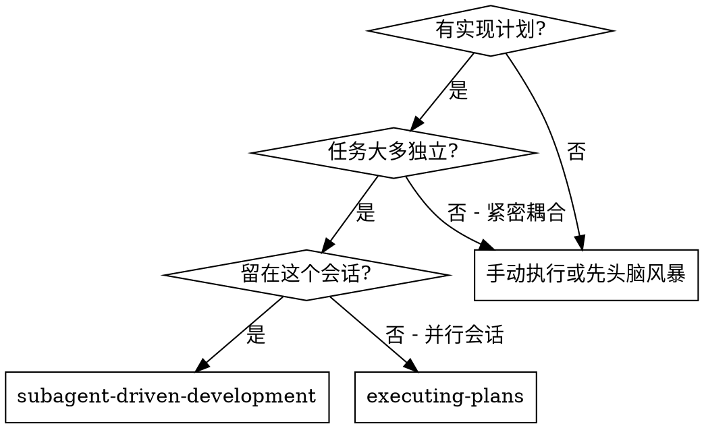
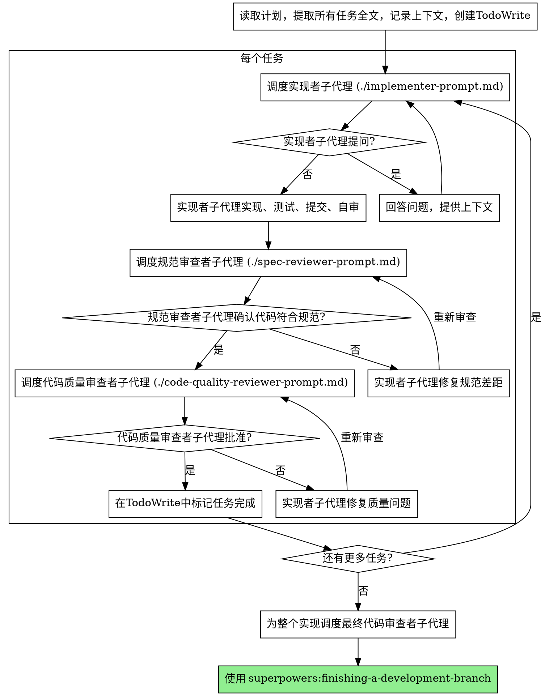

# 子代理驱动开发

通过为每个任务调度新子代理来执行计划，每个任务后进行两阶段审查：首先规范合规性审查，然后代码质量审查。

**为什么使用子代理：** 你将任务委托给具有隔离上下文的专门代理。通过精确制定他们的指令和上下文，你确保他们保持专注并成功完成任务。他们不应该继承你会话的上下文或历史 — 你要构建他们确切需要的内容。这也为你自己的上下文保留协调工作。

**核心原则：** 每个任务新子代理 + 两阶段审查（先规范后质量）= 高质量，快速迭代

## 何时使用



**对比执行计划（并行会话）：**
- 同一会话（无上下文切换）
- 每个任务新子代理（无上下文污染）
- 每个任务后两阶段审查：先规范合规性，然后代码质量
- 更快迭代（任务间无需人工介入）

## 流程



## 模型选择

使用能处理每个角色的最不强大的模型以节省成本并提高速度。

**机械实现任务**（隔离的函数、清晰的规范、1-2个文件）：使用快速、便宜的模型。当计划明确规范时，大多数实现任务是机械的。

**集成和判断任务**（多文件协调、模式匹配、调试）：使用标准模型。

**架构、设计和审查任务**：使用最可用的强大模型。

**任务复杂性信号：**
- 触及1-2个文件且规范完整 → 便宜模型
- 触及多个文件且有集成关注 → 标准模型
- 需要设计判断或广泛代码库理解 → 最强大模型

## 处理实现者状态

实现者子代理报告四种状态之一。适当处理每种：

**DONE：** 继续规范合规性审查。

**DONE_WITH_CONCERNS：** 实现者完成了工作但标记了疑虑。在继续之前阅读关注点。如果关注点是关于正确性或范围，在审查前解决它们。如果它们是观察（例如，"这个文件变大了"），记录它们并继续审查。

**NEEDS_CONTEXT：** 实现者需要未提供的信息。提供缺失的上下文并重新调度。

**BLOCKED：** 实现者无法完成任务。评估阻塞：
1. 如果是上下文问题，提供更多上下文并使用相同模型重新调度
2. 如果任务需要更多推理，使用更强大的模型重新调度
3. 如果任务太大，将其分解为更小的部分
4. 如果计划本身是错误的，升级给人工

**永远不要** 忽略升级或强制相同模型重试而不做更改。如果实现者说卡住了，有些东西需要改变。

## 提示模板

- `./implementer-prompt.md` - 调度实现者子代理
- `./spec-reviewer-prompt.md` - 调度规范合规性审查者子代理
- `./code-quality-reviewer-prompt.md` - 调度代码质量审查者子代理

## 示例工作流

```
你：我正在使用子代理驱动开发来执行这个计划。

[一次读取计划文件：docs/superpowers/plans/feature-plan.md]
[提取所有5个任务全文和上下文]
[用所有任务创建TodoWrite]

任务1：钩安装脚本

[获取任务1文本和上下文（已提取）]
[用完整任务文本 + 上下文调度实现子代理]

实现者："开始前 - 钩应该安装在用户级还是系统级？"

你："用户级（~/.config/superpowers/hooks/）"

实现者："明白了。现在实现..."
[稍后] 实现者：
  - 实现了 install-hook 命令
  - 添加了测试，5/5 通过
  - 自审：发现我漏掉了 --force 标志，添加了它
  - 已提交

[调度规范合规性审查者]
规范审查者：✅ 规范合规 - 所有需求满足，没有额外内容

[获取 git SHA，调度代码质量审查者]
代码审查者：优势：良好的测试覆盖，干净。问题：无。已批准。

[标记任务1完成]

任务2：恢复模式

[获取任务2文本和上下文（已提取）]
[用完整任务文本 + 上下文调度实现子代理]

实现者：[没有问题，继续]
实现者：
  - 添加了验证/修复模式
  - 8/8 测试通过
  - 自审：一切良好
  - 已提交

[调度规范合规性审查者]
规范审查者：❌ 问题：
  - 缺失：进度报告（规范说"每100项报告"）
  - 额外：添加了 --json 标志（未请求）

[实现者修复问题]
实现者：删除了 --json 标志，添加了进度报告

[规范审查者再次审查]
规范审查者：✅ 现在规范合规

[调度代码质量审查者]
代码审查者：优势：扎实。问题（重要）：魔法数字（100）

[实现者修复]
实现者：提取了 PROGRESS_INTERVAL 常量

[代码审查者再次审查]
代码审查者：✅ 已批准

[标记任务2完成]

...

[所有任务后]
[调度最终代码审查者]
最终审查者：所有需求满足，准备合并

完成！
```

## 优势

**对比手动执行：**
- 子代理自然遵循TDD
- 每个任务新鲜上下文（无混淆）
- 并行安全（子代理不干扰）
- 子代理可以提问（工作前后）

**对比执行计划：**
- 同一会话（无交接）
- 持续进度（无需等待）
- 自动审查检查点

**效率提升：**
- 无文件读取开销（控制器提供全文）
- 控制器精确策划所需上下文
- 子代理预先获得完整信息
- 工作开始前就提出问题（不是之后）

**质量门：**
- 自审在交接前捕获问题
- 两阶段审查：规范合规性，然后代码质量
- 审查循环确保修复实际有效
- 规范合规性防止过度/不足构建
- 代码质量确保实现构建良好

**成本：**
- 更多子代理调用（每个任务实现者 + 2个审查者）
- 控制器做更多准备工作（预先提取所有任务）
- 审查循环增加迭代
- 但早期捕获问题（比后期调试便宜）

## 红线警告

**永远不要：**
- 未经用户明确同意在 main/master 分支上开始实现
- 跳过审查（规范合规性或代码质量）
- 带着未修复的问题继续
- 并行调度多个实现子代理（冲突）
- 让子代理读取计划文件（改为提供全文）
- 跳过场景设置上下文（子代理需要理解任务适合哪里）
- 忽略子代理问题（让他们继续前回答）
- 在规范合规性上接受"足够接近"（规范审查者发现问题 = 未完成）
- 跳过审查循环（审查者发现问题 = 实现者修复 = 再次审查）
- 让实现者自审替换实际审查（两者都需要）
- **在规范合规性 ✅ 之前开始代码质量审查**（错误顺序）
- 在任一审查有未解决问题时移动到下一个任务

**如果子代理提问：**
- 清晰完整地回答
- 如果需要提供额外上下文
- 不要急于让他们实现

**如果审查者发现问题：**
- 实现者（相同子代理）修复它们
- 审查者再次审查
- 重复直到批准
- 不要跳过重新审查

**如果子代理任务失败：**
- 用具体指令调度修复子代理
- 不要尝试手动修复（上下文污染）

## 集成

**必需的工作流技能：**
- **superpowers:using-git-worktrees** - 必需：开始前设置隔离的工作空间
- **superpowers:writing-plans** - 创建此技能执行的计划
- **superpowers:requesting-code-review** - 审查者子代理的代码审查模板
- **superpowers:finishing-a-development-branch** - 所有任务完成后完成开发

**子代理应该使用：**
- **superpowers:test-driven-development** - 子代理为每个任务遵循TDD

**替代工作流：**
- **superpowers:executing-plans** - 用于并行会话而不是同会话执行
