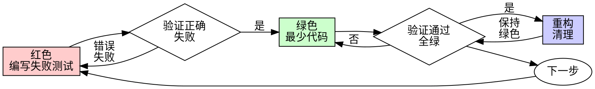

# 测试驱动开发（TDD）

## 概述

先写测试。看着它失败。编写最少的代码使其通过。

**核心原则：** 如果你没有看着测试失败，你不知道它是否测试了正确的东西。
**违反规则的字面意思就是违反规则的精神。**
## 何时使用
**总是：**
- 新功能
- 锥误修复
- 重构
- 行为更改
**例外情况（询问你的合作伙伴）：**
- 一次性原型
- 生成的代码
- 配置文件
想着"只是这一次跳过TDD"？停止。那是合理化。
## 铁律
```
没有失败的测试就不能有生产代码
```
在测试之前写代码？删除它。重新开始。
**没有例外：**
- 不要将其保留为"参考"
- 不要在编写测试时"适应"它
- 不要看它
- 删除意味着删除
从测试开始重新实现。就这样。
## 红-绿-重构

### 红色 - 编写失败测试
编写一个最小测试显示应该发生什么。
<好>
```typescript
test('重试失败的操作3次', async () => {
  let attempts = 0;
  const operation = () => {
    attempts++;
    if (attempts < 3) throw new Error('fail');
    return 'success';
  };
  const result = await retryOperation(operation);
  expect(result).toBe('success');
  expect(attempts).toBe(3);
});
```
名称清晰，测试真实行为，一件事
</好>
<坏>
```typescript
test('重试有效', async () => {
  const mock = jest.fn()
    .mockRejectedValueOnce(new Error())
    .mockRejectedValueOnce(new Error())
    .mockResolvedValueOnce('success');
  await retryOperation(mock);
  expect(mock).toHaveBeenCalledTimes(3);
});
```
名称模糊，测试模拟而非代码
</坏>
**要求：**
- 一个行为
- 名称清晰
- 真实代码（除非不可避免，否则不使用模拟）
### 验证红色 - 看着它失败
**强制性。永远不要跳过。**
```bash
npm test path/to/test.test.ts
```
确认：
- 测试失败（不是错误）
- 失败消息是预期的
- 因为功能缺失而失败（不是拼写错误）
**测试通过？** 你在测试现有行为。修复测试。
**测试出错？** 修复错误，重新运行直到正确失败。
### 绿色 - 最少代码
编写最简单的代码使测试通过。
<好>
```typescript
async function retryOperation<T>(fn: () => Promise<T>): Promise<T> {
  for (let i = 0; i < 3; i++) {
    try {
      return await fn();
    } catch (e) {
      if (i === 2) throw e;
    }
  }
  throw new Error('unreachable');
}
```
刚好足够通过
</好>
<坏>
```typescript
async function retryOperation<T>(
  fn: () => Promise<T>,
  options?: {
    maxRetries?: number;
    backoff?: 'linear' | 'exponential';
    onRetry?: (attempt: number) => void;
  }
): Promise<T> {
  // YAGNI
}
```
过度设计
</坏>
不要添加功能、重构其他代码或"改进"超出测试范围。
### 验证绿色 - 看着它通过
**强制性。**
```bash
npm test path/to/test.test.ts
```
确认：
- 测试通过
- 其他测试仍然通过
- 输出干净（无错误、警告）
**测试失败？** 修复代码，不是测试。
**其他测试失败?** 现在修复。
### 重构 - 清理
只有在绿色后：
- 删除重复
- 改进命名
- 提取辅助函数
保持测试绿色。不要添加行为。
### 重复
为下一个功能编写下一个失败测试。
## 好的测试
| 质量 | 好 | 坏 |
|------|------|------|
| **最小** | 一件事。名称中有"和"？拆分它。 | `test('验证电子邮件和域名和空白')` |
| **清晰** | 名称描述行为 | `test('test1')` |
| **展示意图** | 演示期望的API | 模糊代码应该做什么 |
## 为什么顺序很重要
**"我会在之后编写测试来验证它有效"**
之后编写的测试立即通过。立即通过什么也证明不了：
- 可能测试错误的东西
- 可能测试实现，而不是行为
- 可能遗漏你忘记的边缘情况
- 你从未看到它捕获错误
测试优先强制你看到测试失败，证明它实际上测试了某些东西。
**"我已经手动测试了所有边缘情况"**
手动测试是临时的。你认为你测试了所有内容但：
- 没有记录你测试了什么
- 代码更改时无法重新运行
- 在压力下很容易忘记情况
- "我尝试时有效" ≠ 全面
自动化测试是系统性的。它们每次都以相同的方式运行。
**"删除X小时的工作是浪费"**
沉没成本谬误。时间已经过去了。你现在的选择：
- 删除并用TDD重写（X更多小时，高信心）
- 保留它并在之后添加测试（30分钟，低信心，可能有错误）
"浪费"是保留你无法信任的代码。没有真正测试的工作代码是技术债务。
**"TDD是教条的，务实意味着适应"**
TDD是务实的：
- 在提交前发现错误（比之后调试更快）
- 防止回归（测试立即捕获破坏）
- 记录行为（测试展示如何使用代码）
- 启用重构（自由更改，测试捕获破坏）
"务实"的捷径 = 生产环境调试 = 更慢。
**"之后的测试达到相同的目标 - 是精神而不是仪式"**
不。之后的测试回答"这个做什么？"测试优先回答"这个应该做什么？"
之后的测试受你实现的影响。你测试你构建的，而不是要求的。你验证记住的边缘情况，而不是发现的。
测试优先强制在实现前发现边缘情况。之后的测试验证你记住了一切（你没有）。
之后30分钟的测试 ≠ TDD。你获得了覆盖率，失去了测试有效的证明。
## 常见合理化
| 借口 | 现实 |
|------|------|
| "太简单不需要测试" | 简单代码也会出错。测试需要30秒。 |
| "我会在之后测试" | 立即通过的测试什么也证明不了。 |
| "之后的测试达到相同目标" | 之后的测试 = "这个做什么？" 测试优先 = "这个应该做什么？" |
| "已经手动测试" | 临时的 ≠ 系统性的。没有记录，无法重新运行。 |
| "删除X小时是浪费" | 沉没成本谬误。保留未验证的代码是技术债务。 |
| "保留作为参考，先写测试" | 你会适应它。那是之后测试。删除意味着删除。 |
| "需要先探索" | 可以。丢弃探索，用TDD开始。 |
| "测试困难 = 设计不清楚" | 听测试的。难测试 = 难使用。 |
| "TDD会让我变慢" | TDD比调试快。务实 = 测试优先。 |
| "手动测试更快" | 手动不能证明边缘情况。每次更改都要重新测试。 |
| "现有代码没有测试" | 你正在改进它。为现有代码添加测试。 |
## 红线警告 - 停止并重新开始
- 测试之前有代码
- 实现之后有测试
- 测试立即通过
- 无法解释为什么测试失败
- "稍后"添加测试
- 合理化"只是这一次"
- "我已经手动测试了"
- "之后的测试达到相同目的"
- "这是精神而不是仪式"
- "保留作为参考" 或 "适应现有代码"
- "已经花了X小时，删除是浪费"
- "TDD是教条的，我是务实的"
- "这不同因为..."
**所有这些都意味着：删除代码。用TDD重新开始。**
## 示例：错误修复
**错误：** 接受空电子邮件
**红色**
```typescript
test('拒绝空电子邮件', async () => {
  const result = await submitForm({ email: '' });
  expect(result.error).toBe('需要电子邮件');
});
```
**验证红色**
```bash
$ npm test
失败：期望 '需要电子邮件'，得到 undefined
```
**绿色**
```typescript
function submitForm(data: FormData) {
  if (!data.email?.trim()) {
    return { error: '需要电子邮件' };
  }
  // ...
}
```
**验证绿色**
```bash
$ npm test
通过
```
**重构**
如果需要，为多个字段提取验证。
## 验证清单
在标记工作完成之前：
- [ ] 每个新函数/方法都有测试
- [ ] 在实现之前看着每个测试失败
- [ ] 每个测试因预期原因失败（功能缺失，不是拼写错误）
- [ ] 编写最少代码使每个测试通过
- [ ] 所有测试通过
- [ ] 输出干净（无错误、警告）
- [ ] 测试使用真实代码（只有在不可避免时才使用模拟）
- [ ] 边缘情况和错误已覆盖
无法勾选所有框？你跳过了TDD。重新开始。
## 卡住时
| 问题 | 解决方案 |
|------|----------|
| 不知道如何测试 | 编写期望的API。先编写断言。询问你的合作伙伴。 |
| 测试太复杂 | 设计太复杂。简化接口。 |
| 必须模拟所有内容 | 代码耦合太多。使用依赖注入。 |
| 测试设置巨大 | 提取辅助函数。仍然复杂？简化设计。 |
## 调试集成
发现错误？编写复现它的失败测试。遵循TDD循环。测试证明修复并防止回归。
永远不要没有测试就修复错误。
## 测试反模式
当添加模拟或测试工具时，阅读 @testing-anti-patterns.md 以避免常见陷阱：
- 测试模拟行为而不是真实行为
- 向生产类添加仅用于测试的方法
- 不理解依赖就进行模拟
## 最终规则
```
生产代码 → 测试存在且首先失败
否则 → 不是TDD
```
没有你合作伙伴的许可就没有例外。
