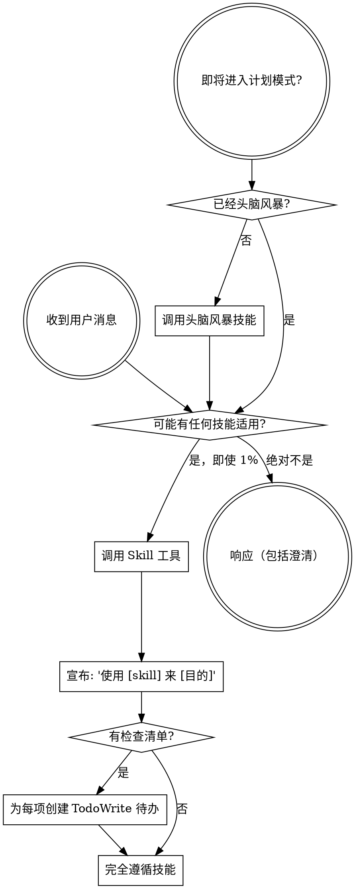

<SUBAGENT-STOP>
如果你是作为子代理被调度执行特定任务，跳过此技能。
</SUBAGENT-STOP>

<EXTREMELY-IMPORTANT>
如果你认为有哪怕 1% 的可能性某个技能可能适用于你正在做的事情，你绝对必须调用该技能。

如果技能适用于你的任务，你没有选择。你必须使用它。

这是不可协商的。这不是可选的。你不能用合理化来逃避这一点。
</EXTREMELY-IMPORTANT>

## 指令优先级

Superpowers 技能覆盖默认系统提示行为，但**用户指令始终优先**：

1. **用户的明确指令**（CLAUDE.md、GEMINI.md、AGENTS.md、直接请求）— 最高优先级
2. **Superpowers 技能** — 在冲突的地方覆盖默认系统行为
3. **默认系统提示** — 最低优先级

如果 CLAUDE.md、GEMINI.md 或 AGENTS.md 说"不要使用 TDD"，而某个技能说"始终使用 TDD"，遵循用户的指令。用户是控制者。

## 如何访问技能

**在 Claude Code 中：** 使用 `Skill` 工具。当你调用技能时，其内容被加载并呈现给你 — 直接遵循它。永远不要对技能文件使用 Read 工具。

**在 Gemini CLI 中：** 技能通过 `activate_skill` 工具激活。Gemini 在会话开始时加载技能元数据并按需激活完整内容。

**在其他环境中：** 检查你平台的文档了解技能如何加载。

## 平台适应

技能使用 Claude Code 工具名称。非 CC 平台：见 `references/codex-tools.md`（Codex）了解工具等效项。Gemini CLI 用户通过 GEMINI.md 自动加载工具映射。

# 使用技能

## 规则

**在任何响应或行动之前调用相关或请求的技能。** 即使只有 1% 的可能性某个技能可能适用，你也应该调用该技能来检查。如果调用的技能结果不适合该情况，你不需要使用它。

## 红线警告

这些想法意味着停止 — 你在合理化：

| 想法 | 现实 |
|------|------|
| "这只是一个简单的问题" | 问题是任务。检查技能。 |
| "我需要先更多上下文" | 技能检查在澄清问题之前。 |
| "让我先探索代码库" | 技能告诉你如何探索。先检查。 |
| "我可以快速检查 git/文件" | 文件缺乏对话上下文。检查技能。 |
| "让我先收集信息" | 技能告诉你如何收集信息。 |
| "这不需要正式技能" | 如果技能存在，使用它。 |
| "我记得这个技能" | 技能会演进。阅读当前版本。 |
| "这不算任务" | 行动 = 任务。检查技能。 |
| "技能是杀鸡用牛刀" | 简单的事情会变复杂。使用它。 |
| "我只是先做这一件事" | 在做任何事情之前检查。 |
| "这感觉很有成效" | 不受约束的行动浪费时间。技能防止这种情况。 |
| "我知道那意味着什么" | 知道概念 ≠ 使用技能。调用它。 |

## 技能优先级

当多个技能可能适用时，使用此顺序：

1. **流程技能优先**（头脑风暴、调试）- 这些决定如何处理任务
2. **实现技能其次**（frontend-design、mcp-builder）- 这些指导执行

"让我们构建 X" → 先头脑风暴，然后实现技能。
"修复这个错误" → 先调试，然后特定领域技能。

## 技能类型

**严格的**（TDD、调试）：完全遵循。不要适应掉纪律。

**灵活的**（模式）：将原则适应上下文。

技能本身会告诉你哪个。

## 用户指令

指令说做什么，而不是如何做。"添加 X" 或 "修复 Y" 不意味着跳过工作流。
